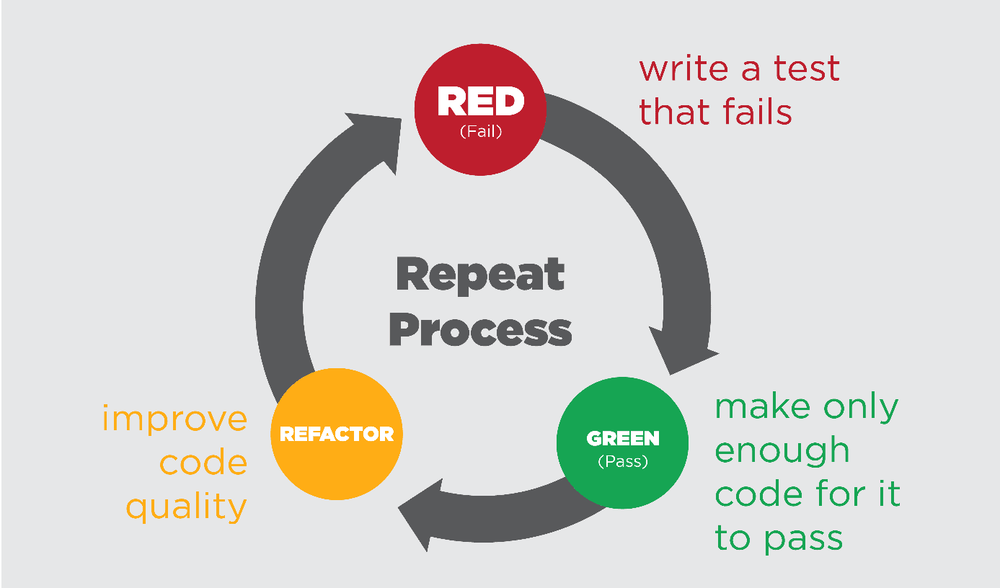

# Test Driven Development with Express.js

## What is Test Driven Development?

Test Driven Development (TDD) is a software development approach where tests are
written before writing the actual code. This methodology follows a simple yet
powerful cycle:

1. **Red**: Write a failing test
2. **Green**: Write minimal code to make the test pass
3. **Refactor**: Improve the code while keeping tests green



### Benefits of TDD

- **Improved Code Quality**: Writing tests first ensures better code design and
  maintainability
- **Better Documentation**: Tests serve as living documentation of code behavior
- **Reduced Debugging Time**: Catch bugs early in the development cycle
- **Confident Refactoring**: Tests ensure existing functionality remains intact
- **Clear Requirements**: Tests help clarify requirements before implementation

## Project Setup with Jest and Supertest

### 1. Initialize Project

```bash
# Create project directory
mkdir express-tdd-project
cd express-tdd-project

# Initialize npm project
npm init -y
```

### 2. Install Dependencies

```bash
# Install main dependencies
npm install express

# Install development dependencies
npm install --save-dev typescript ts-jest jest @types/jest @types/express supertest @types/supertest
```

### 3. Configure TypeScript

Create `tsconfig.json`:

```json
{
  "compilerOptions": {
    "target": "es6",
    "module": "commonjs",
    "outDir": "./dist",
    "rootDir": "./src",
    "strict": true,
    "esModuleInterop": true,
    "skipLibCheck": true,
    "forceConsistentCasingInFileNames": true
  },
  "include": ["src/**/*"],
  "exclude": ["node_modules", "**/*.test.ts"]
}
```

### 4. Configure Jest

Create `jest.config.js`:

```javascript
module.exports = {
  preset: 'ts-jest',
  testEnvironment: 'node',
  testMatch: ['**/*.test.ts'],
  verbose: true,
  forceExit: true,
  clearMocks: true,
  resetMocks: true,
  restoreMocks: true,
};
```

### 5. Update package.json Scripts

```json
{
  "scripts": {
    "start": "node dist/server.js",
    "dev": "nodemon src/server.ts",
    "build": "tsc",
    "test": "jest",
    "test:watch": "jest --watch",
    "test:coverage": "jest --coverage"
  }
}
```

## Project Structure

```
express-tdd-project/
├── src/
│   ├── app.ts
│   ├── server.ts
│   ├── routes/
│   │   └── user.routes.ts
│   ├── controllers/
│   │   └── user.controller.ts
│   └── __tests__/
│       ├── user.routes.test.ts
│       └── user.controller.test.ts
├── jest.config.js
├── tsconfig.json
└── package.json
```

## Example Implementation

### 1. Create Express App (src/app.ts)

```typescript
import express from 'express';
import userRoutes from './routes/user.routes';

const app = express();
app.use(express.json());
app.use('/api/users', userRoutes);

export default app;
```

### 2. Write Tests (src/**tests**/user.routes.test.ts)

```typescript
import request from 'supertest';
import app from '../app';

describe('User API Endpoints', () => {
  describe('GET /api/users', () => {
    it('should return list of users', async () => {
      const response = await request(app)
        .get('/api/users')
        .expect('Content-Type', /json/)
        .expect(200);

      expect(Array.isArray(response.body)).toBeTruthy();
    });
  });

  describe('POST /api/users', () => {
    it('should create a new user', async () => {
      const userData = {
        name: 'Binod Gautam',
        email: 'gautambinod629@gmail.com',
      };

      const response = await request(app)
        .post('/api/users')
        .send(userData)
        .expect('Content-Type', /json/)
        .expect(201);

      expect(response.body).toHaveProperty('id');
      expect(response.body.name).toBe(userData.name);
    });

    it('should validate required fields', async () => {
      const response = await request(app)
        .post('/api/users')
        .send({})
        .expect('Content-Type', /json/)
        .expect(400);

      expect(response.body).toHaveProperty('error');
    });
  });
});
```

## Jest Testing Features

### Mock Functions

Jest provides powerful mocking capabilities for testing:

```typescript
// Create a mock function
const mockFn = jest.fn();

// Configure mock return value
mockFn.mockReturnValue(42);
```

### Additional Matchers Examples

#### Number and Comparison Matchers

```typescript
test('number matchers', () => {
  const value = 42;
  // Numeric comparisons
  expect(value).toBeGreaterThan(40);
  expect(value).toBeLessThan(50);
  expect(value).toBeGreaterThanOrEqual(42);
  expect(value).toBeLessThanOrEqual(42);
});
```

#### String Matchers

```typescript
test('string matchers', () => {
  const str = 'Hello, TypeScript!';
  // String matching
  expect(str).toMatch(/TypeScript/);
  expect(str).toContain('Hello');
  expect(str).not.toContain('JavaScript');
});
```

## Running Tests

```bash
# Run all tests
npm test

# Run tests in watch mode
npm run test:watch

# Generate coverage report
npm run test:coverage
```

## Best Practices

### Write Meaningful Tests

- Test names should clearly describe expected behavior
- Follow the Arrange-Act-Assert pattern
- Test both success and error cases

### Keep Tests Focused

- Each test should verify one specific behavior
- Avoid testing multiple things in a single test
- Use beforeEach/afterEach for setup and cleanup

### Maintain Test Independence

- Tests should not depend on each other
- Clean up test data after each test
- Use mocks for external dependencies

### Follow the TDD Cycle

1. Write the test first
2. See it fail
3. Write minimal code to make it pass
4. Refactor while keeping tests green
